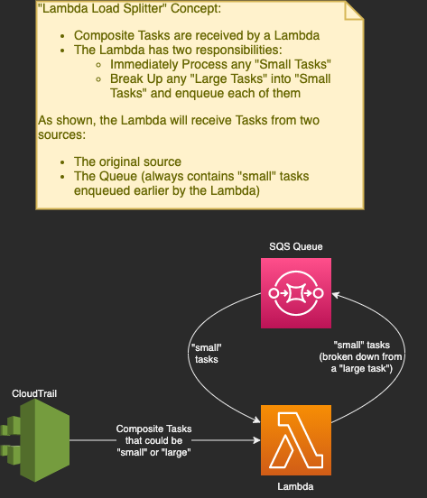
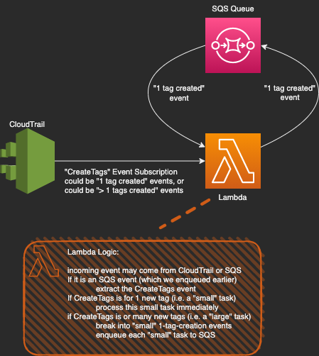

# AWS Lambda Load Splitter

This AWS Code Sample shows how an AWS Lambda Function and Amazon Simple Queue Service (Amazon SQS) can be used together to split a large Lambda task into smaller Lambda sub-tasks and process the smaller sub-tasks in parallel, thus increasing Lambda processing throughput.

## Table of Contents
* [Concept](#concept)
* [AWS Resources and Lambda Logic](#aws-resources-and-lambda-logic)
* ['CreateTags' Example](#createtags-example)
* [Prerequisites](#prerequisites)
* [Tests](#tests)
* [Deployment](#deployment)
* [Executing the Sample](#executing-the-sample)
  * [Triggering the Lambda Manually](#triggering-the-lambda-manually)
  * [Triggering the Lambda With Real Tag Creations](#triggering-the-lambda-with-real-tag-creations)
* [License](#license)

# Concept

This code sample illustrates how a lambda function can split a large task into a number of smaller sub-tasks and then process them in parallel. This is useful when a lambda function is asked to perform a large time-consuming task that is effectively composed of a large number of independent smaller sub-tasks. Rather than have the lambda process all the sub-tasks in a serial fashion, which can be time-consuming, the strategy shown in this sample is for the lambda to split the large task into smaller sub-tasks and queue them using SQS. The same lambda then reads the SQS-queued sub-tasks and process them. Since SQS is used, AWS will instantiate many instances of the Lambda in parallel to process the queued sub-tasks, and thus the whole job will be finished much sooner.

   
  
   

# AWS Resources and Lambda Logic

The main two AWS resources required to implement this strategy are:

  1. An Amazon SQS Queue
  1. A Lambda Function (with a subscription to the Amazon SQS Queue)

The Lambda will handle its work requests differently based on the "size" of the Task it is asked to work on:

  * Tasks that are 'small' will be immediately processed by the Lambda
  * Tasks that are 'large' will be slit up into a number of 'small' sub-tasks and sent to the Amazon SQS Queue

Given the use of the queue, the Lambda will thus have two sources of work:

  * Whatever source is originally sending the Tasks
    - These Tasks may be 'small' or 'large' tasks
  * The Amazon SQS Queue which will be holding the 'small' sub-tasks (that the Lambda has previously queued)
    - These Sub-Tasks will always be of 'small' size

# CreateTags Example

The load-splitting strategy is demonstrated in this code sample using the AWS CloudTrail 'CreateTag' API event, which sends out one event when any number of Tags are added to an Amazon EC2 instance. This single event announcing multiple new Tags will represent our "large task" (which we can imagine is some time-consuming process that must be performed for each new Tag). The 'CreateTag' API event is selected as an example event source since it is easy to create many EC2 tags using either the AWS Console, or the CLI, thus triggering the code sample Lambda.

If only one Tag is created on an EC2 instance, the CloudTrail event will announce just one tag as having been created, and the Lambda considers this to be a 'small' task (just 1 tag being created), and the Lambda will simply process it directly. (CloudWatch Logs will show just one Lambda invocation for the CloudTrail event annoucing the one Tag creation event)

If multiple Tags are created on an EC2 instance, the CloudTrail event will annouce all the tags. The Lamba will consider this to be a 'large' task (more than 1 tag being created) and will enqueue each sub-task to the Amazon SQS Queue, one for each separate Tag being created. Each message placed in the Queue is simply the original CloudTrail event received, except that that list of tags is changed to be just one tag. As each sub-task message is queued, a new instance of the Lambda will be instantiated to process each sub-task, each of which will annouce just a single tag creation, and thus each Lambda invocation driven by the Amazon SQS Queue will simply process its 'small' sub-task directly. (CloudWatch Logs will show 'N+1' Lambda invocations when there were 'N' new tags created on an Instance: '1' invocation for the original CloudTrail event annoucing all the tags, and 'N' additional invocations, one for each Amazon SQS Message containing a single tag creation announcement.

   
  
   

In the sample code, the "processing" of each tag is simulated by a 5 second sleep. Thus, "processing" 5 tags serially would require 25 seconds of elapsed time, but using this load-splitting strategy, the elapsed time is closer to just 5 seconds, since the "processing" is all performed in parallel by different Lambda invocations.

# Prerequisites

The following are required to deploy this sample:
* An AWS Account in which you have Administrative permissions
  * _or sufficient permissions to create AWS Identity and Access Management (IAM) Policies and Roles, Lambda Functions, Amazon SQS Queues, Amazon EventBridge Rules, and EC2 Instances_
* Terraform 1.0

The following are required if you want to run the unit tests:
* python 3.8
* pip

# Tests

If you would like to run the unit tests in your local environment, you will need some python libraries. Install them and run the tests by running:
* `cd load_splitter_lambda/`
* `pip install -r requirements_dev.txt` (will install boto3, mock, moto, pytest, tox)
* `pytest -W ignore::DeprecationWarning`

Alternatively, if you don't want `pip` installing libraries in your current environment, you can use `tox` which will effectively install the libraries and run the tests in and isolated environment, although this can be slower:
* `pip install tox`
* `tox`

# Deployment

To deploy the sample code to your Amazon account, execute the following:

* (optional) create a terraform.tfvars and set the 'prefix' variable
* `terraform init`
* `terraform apply`

# Executing the Sample

## Triggering the Lambda Manually

You can execute the Lambda manually from the AWS Console to verify that it works correctly. Use one of the following JSON test input files which are deployed with the Lambda from the code/ folder, allowing you to easily access them from the AWS Console:

- `code/test-input-1-tag.json`  (JSON CloudTrail event announcing the creation of 1 tag)
- `code/test-input-5-tags.json` (JSON CloudTrail event announcing the creation of 5 tags)

To use these test input files, go to the Lambda "Test" tab for the function and create a new test event. Paste in the contents of one of the files and give the test event a name. Then execute the Test.

In the case of the `5-tags` JSON event, the lambda run and queue 5 messages, one per tag, and these 5 queued messages will then invoke the lambda again 5 times. Examine the Lambda's CloudWatch Logs to see how the lambda ran a total of 6 times.

## Triggering the Lambda With Real Tag Creations

To see the full example, create an EC2 instance, then add multiple tags, and save them. This will trigger the Lambda. Check the CloudWatch Logs to verify that the Lambda was executed N+1 times (where N is the number of tags created). Also note that all tags are processed in about 5 seconds elapsed time, and not in N*5 seconds.

# Cleanup

To cleanup your resources in your AWS Account, do the following:

* Locate the Log Group for the "load_splitter_lambda" Lambda Function and delete the logs
* run `terraform destroy`

# License

This sample code is licensed under the MIT-0 License. See the LICENSE file.
